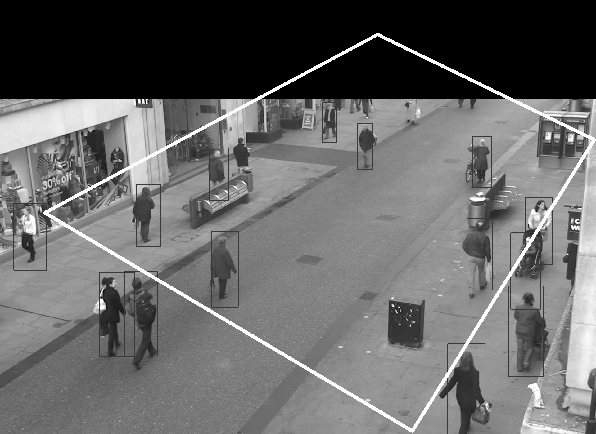

# social-distance - Computer Vision

Repositorio Git:

https://github.com/a20144012/social-distance

## Ejecutar el proyecto

Para utilizar la siguiente aplicacion:

Se debe de copiar el archivo .csv a la ruta:

input-csv/TC.csv

Y el video de entrada en la ruta

video/TownCentreXVID.avi

Ejecutar el siguiente comando:

>python social-distance-cv.py

El video de salida se creará en la ruta:

video/TownCentreXVID_output.avi

#### Opción 1

La imagen siguiente muestra los puntos de referencia tomados

#### Opción 2

La imagen siguiente muestra los puntos de referencia tomados

La imagen siguiente muestra la imagen con la perspectiva aplicada

